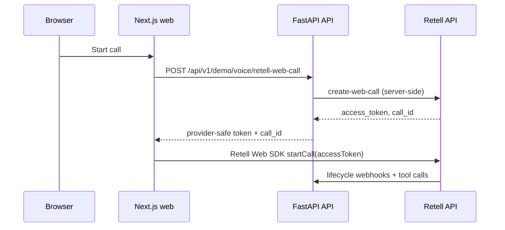

# Retell Dashboard Setup Runbook

This runbook describes how to configure the **Retell dashboard** for the portfolio public demo. The backend and frontend in this repository already expose tool routes, verified webhooks, web-call creation, and the Retell Web SDK entry point. Retell project setup (agent, prompts, custom functions, webhooks) happens **outside the repo** in the Retell console.

Use this document together with:

- [Public Demo Deployment](public-demo-deployment.md)
- [Configuration](../configuration.md)
- [Retell Tool-Calling Adapter](../architecture/retell-tool-calling-adapter.md)
- [Clinic Time Context and Tool Contracts](../architecture/clinic-time-context-and-tool-contracts.md)
- [Retell Webhook Security](../architecture/retell-webhook-security.md)
- [Retell Call Lifecycle](../architecture/retell-call-lifecycle.md)

## Prerequisites

Before configuring Retell:

| Requirement | Notes |
|-------------|--------|
| **Hosted API** | Public HTTPS origin for the FastAPI app (for example `https://api.example.com`) |
| **PostgreSQL + Redis** | Required for voice persistence, holds, and public demo guardrails |
| **Migrations applied** | `python -m alembic upgrade head` |
| **Demo data (optional)** | `python -m scripts.seed_demo_data` if you rely on pre-seeded availability |
| **Retell account** | Retell project with API key access |
| **Public demo guardrails** | `PUBLIC_DEMO_MODE=true` and `PUBLIC_DEMO_GUARDRAILS_ENABLED=true` for internet-facing demos |
| **Frontend (optional)** | Next.js `web/` app with `NEXT_PUBLIC_VOICE_DEMO_ENABLED=true` for browser web calls |

Treat all demo traffic as **fictional clinic data**. Do not use real patient names, phone numbers, dates of birth, or medical information in prompts, test calls, or recordings.

## Environment Variable Checklist

Configure these on the **API service** (see `.env.demo.example` and [Configuration](../configuration.md)). Secrets belong in the platform secret manager, not in Git or `NEXT_PUBLIC_*` frontend env.

### Retell inbound (tools + lifecycle webhooks)

| Variable | Required when | Notes |
|----------|---------------|--------|
| `RETELL_ENABLED` | Voice tools/webhooks | `true` to accept Retell callbacks |
| `RETELL_API_KEY` | Web calls + Retell API use | Server-side only; never in `web/` |
| `RETELL_WEBHOOK_VERIFICATION_ENABLED` | Hosted demo | Keep `true` |
| `RETELL_WEBHOOK_SECRET` | `RETELL_ENABLED=true` and verification on | From Retell webhook settings |
| `RETELL_ALLOW_INSECURE_WEBHOOKS` | Never in production-like env | `false` only outside local/test |
| `RETELL_SIGNATURE_HEADER_NAME` | Optional | Default `x-retell-signature` |
| `RETELL_REQUEST_MAX_BODY_BYTES` | Optional | Default `262144` |

### Retell web calls (browser demo)

| Variable | Required when | Notes |
|----------|---------------|--------|
| `RETELL_WEB_CALL_ENABLED` | Public web voice demo | `true` to allow `POST /api/v1/demo/voice/retell-web-call` |
| `RETELL_AGENT_ID` | `RETELL_WEB_CALL_ENABLED=true` | Agent ID from Retell dashboard |
| `RETELL_AGENT_VERSION` | Optional | Numeric version or tag (for example `1`, `prod`) |
| `RETELL_WEB_CALL_TIMEOUT_SECONDS` | Optional | Default `10` |

### Clinic context (must match agent instructions)

| Variable | Notes |
|----------|--------|
| `CLINIC_TIMEZONE` | IANA timezone (default `America/New_York`) |
| `CLINIC_BUSINESS_DAYS` | Comma-separated weekdays |
| `CLINIC_BUSINESS_HOURS_START` / `CLINIC_BUSINESS_HOURS_END` | `HH:MM` 24-hour |
| `CLINIC_NAME` | Spoken/display name for demo |

### Frontend (web service only)

| Variable | Notes |
|----------|--------|
| `NEXT_PUBLIC_VOICE_DEMO_ENABLED` | `true` to show live voice UI |
| `API_PROXY_TARGET` | Proxies `/api/v1/*` to API origin |
| **Never** | `NEXT_PUBLIC_RETELL_*`, API keys, or webhook secrets |

### Safe smoke-test fallback (chat-only)

```env
RETELL_ENABLED=false
RETELL_WEB_CALL_ENABLED=false
NEXT_PUBLIC_VOICE_DEMO_ENABLED=false
```

## Agent Setup Steps

1. **Create or select an agent** in the Retell dashboard for the fictional demo clinic receptionist.
2. **Copy the agent ID** into `RETELL_AGENT_ID` when web calls are enabled.
3. **Choose a response engine** supported by your Retell project (Retell LLM or conversation flow). Tool definitions must call the backend HTTP endpoints documented below.
4. **Set the agent language/locale** to match `CLINIC_LOCALE` (default `en-US`).
5. **Publish the agent version** you intend to use; set `RETELL_AGENT_VERSION` if you pin a specific version or tag.
6. **Disable phone/PSTN routing** for the portfolio web-demo path unless you explicitly need telephony; this runbook targets **web calls** via the public demo API and Retell Web SDK.
7. **Smoke-test in Retell’s test UI** only with fictional patient details after backend env vars and webhooks are configured.

## Prompt Guidance

Configure the agent system prompt and conversation instructions to align with backend contracts. The **backend tools are the source of truth** for scheduling, holds, booking, cancellation, and rescheduling. The LLM must not invent availability or confirm appointments without a successful tool result.

Include these rules in the Retell agent prompt:

1. **Fictional demo only** — This is a portfolio demo for a fictional clinic. Do not collect or repeat real patient health information. Use clearly fake names and contact details in tests.
2. **Do not calculate relative dates** — Retell and the LLM must **not** infer “today”, “tomorrow”, weekday names, or UTC timestamps from model knowledge.
3. **Call `get_clinic_context` first** — Before discussing the current date, time, business hours, “today”, “tomorrow”, or relative scheduling language, call `get_clinic_context` and use its response.
4. **Use structured scheduling arguments** — Prefer `date_expression` and optional `time_window_expression` in `check_availability`. Do not pass provider-calculated UTC windows as the primary contract.
5. **Confirm only after tools succeed** — Do not tell the caller an appointment is booked, cancelled, or rescheduled until `book_appointment`, `cancel_appointment`, or `reschedule_appointment` returns success.
6. **Hold before book** — Obtain an active hold with `hold_appointment_slot` before `book_appointment`.
7. **Explicit confirmation** — Booking, cancellation, and rescheduling tools require explicit caller confirmation in tool arguments.

See [Clinic Time Context and Tool Contracts](../architecture/clinic-time-context-and-tool-contracts.md) for the canonical prompt guidance and tool contracts.

## Custom Function / Tool Setup Checklist

Register **custom functions** (or equivalent HTTP tools) in the Retell dashboard pointing at your **public API origin**. Use the unified tool executor unless you rely on legacy per-tool routes.

### Unified tool endpoint (recommended)

| Setting | Value |
|---------|--------|
| **URL** | `https://<api-host>/api/v1/retell/tools` |
| **Method** | `POST` |
| **Auth** | Retell webhook signature (Retell sends `x-retell-signature`; backend verifies with `RETELL_WEBHOOK_SECRET`) |

### Supported tool names (allowlist)

Register only tools implemented by the backend:

| Tool name | Side effects | Notes |
|-----------|--------------|--------|
| `get_clinic_context` | No | Call before discussing date/time/hours |
| `check_availability` | No | Prefer `date_expression` |
| `hold_appointment_slot` | Yes | Redis-backed hold |
| `release_appointment_hold` | Yes | Releases caller’s hold |
| `book_appointment` | Yes | Requires hold + identity + confirmation |
| `cancel_appointment` | Yes | Requires confirmation |
| `reschedule_appointment` | Yes | Requires confirmation + target hold/slot |

Do **not** register tools that bypass this allowlist. Unsupported tools return `unsupported_retell_tool`.

### Per-tool checklist

- [ ] Tool name matches the backend allowlist exactly (snake_case).
- [ ] Request body includes `tool_name`, `arguments`, and `call` / `provider_call_id` as required by Retell’s callback shape (see [Retell Tool API](../api/retell-tools.md)).
- [ ] Tool URL uses HTTPS and matches the deployed API host.
- [ ] Retell project webhook secret matches `RETELL_WEBHOOK_SECRET`.
- [ ] `get_clinic_context` is available and invoked before relative date discussion in prompt tests.
- [ ] `check_availability` test uses `date_expression` (not free-form date math).
- [ ] Side-effecting tools are tested with fictional identity data only.

Legacy per-tool routes under `/api/v1/retell/tools/*` remain for compatibility; new dashboard setup should prefer the unified route.

## Webhook Setup Checklist

### Lifecycle webhook

| Setting | Value |
|---------|--------|
| **URL** | `https://<api-host>/api/v1/retell/webhooks/lifecycle` |
| **Verification** | **Must stay enabled** — `RETELL_WEBHOOK_VERIFICATION_ENABLED=true` |
| **Secret** | Copy into `RETELL_WEBHOOK_SECRET` |

Lifecycle events create/update `VoiceCall` and `VoiceCallEvent` records. They do **not** execute scheduling tools.

### Security requirements

- [ ] `RETELL_WEBHOOK_VERIFICATION_ENABLED=true` in every production-like environment.
- [ ] `RETELL_ALLOW_INSECURE_WEBHOOKS=false` in production-like `APP_ENV`.
- [ ] Webhook secret stored only in the API secret manager.
- [ ] Public demo guardrails enabled (`PUBLIC_DEMO_GUARDRAILS_ENABLED=true`).
- [ ] `TRUST_PROXY_HEADERS=true` when behind a reverse proxy so per-IP limits work.

Invalid signatures are rejected **before** guardrails or tool logic run (see [Retell Webhook Security](../architecture/retell-webhook-security.md)).

## Web Call Setup Steps

Web calls let the browser join a Retell room without exposing `RETELL_API_KEY` to the client.

### Backend

1. Set `RETELL_WEB_CALL_ENABLED=true`.
2. Set `RETELL_API_KEY` and `RETELL_AGENT_ID` (and optional `RETELL_AGENT_VERSION`).
3. Keep `RETELL_ENABLED=true` if you also use tool and lifecycle webhooks on the same deployment.
4. Deploy the API and confirm `POST /api/v1/demo/voice/retell-web-call` returns `access_token` and `call_id` (with guardrails and demo mode configured).

### Frontend

1. Set `NEXT_PUBLIC_VOICE_DEMO_ENABLED=true` on the web service.
2. Set `API_PROXY_TARGET` to the API origin (or serve UI and API on the same public host).
3. Deploy `web/` (`npm run build` / `npm run start`).
4. Confirm the voice panel requests **no microphone** when the flag is `false`.

### Retell dashboard

1. Use the same **agent ID** as `RETELL_AGENT_ID`.
2. Web calls do not require a separate Retell “phone number”; the browser uses the Retell Web SDK with the server-issued `access_token`.
3. Start the browser call within **30 seconds** of receiving the access token (Retell invalidates stale tokens).

Flow:



## Safety Boundaries

| Rule | Rationale |
|------|-----------|
| **Backend tools are source of truth** | Retell must not calculate availability, dates, or appointment outcomes locally |
| **No relative date math in Retell** | Use `get_clinic_context` + structured `date_expression` |
| **Webhook verification stays enabled** | Prevents unsigned tool and lifecycle callbacks |
| **No real patient data** | Portfolio demo only; fictional names and scenarios |
| **No API keys in frontend** | `RETELL_API_KEY` only on API; browser uses short-lived `access_token` |
| **Do not store access tokens in localStorage** | Frontend keeps tokens in memory for the active session only |
| **Public demo guardrails** | Rate limits on chat, Retell tools, and voice web-call creation |
| **Signature before guardrails** | Invalid Retell signatures do not consume rate-limit counters |

The adapter cannot bypass `AppointmentBookingService`, hold rules, clinic business hours, or confirmation requirements (see [Retell Tool-Calling Adapter](../architecture/retell-tool-calling-adapter.md)).

## Smoke Test Checklist

After dashboard and deployment configuration:

### API / Retell inbound

- [ ] `GET /health` and `GET /health/dependencies` return `200`.
- [ ] With `RETELL_ENABLED=false`, Retell routes return `503` / `retell_disabled` (expected until enabled).
- [ ] With `RETELL_ENABLED=true`, unsigned tool request returns signature error (not `200`).
- [ ] Retell test tool call to `get_clinic_context` returns clinic name, timezone, `current_date`, and business hours.
- [ ] Lifecycle webhook delivery creates a `VoiceCall` row for the provider `call_id`.
- [ ] `check_availability` with `date_expression: { "kind": "tomorrow" }` returns slots or a structured error (not a crash).

### Web call + frontend

- [ ] With `NEXT_PUBLIC_VOICE_DEMO_ENABLED=false`, voice panel shows configuration preview and **does not** request microphone.
- [ ] With flags enabled, **Start call** returns `access_token` via backend (check network tab: no `RETELL_API_KEY` in browser).
- [ ] Retell Web SDK connects and call reaches connected state with fictional test speech.
- [ ] **End call** resets UI to ended/idle.
- [ ] Backend error (for example disabled web call) shows a safe message (`voice_demo_disabled`, `rate_limited`, etc.), not raw provider payloads.

### Abuse / demo safety

- [ ] Repeated voice or tool requests eventually return `429` when guardrails are enabled.
- [ ] Demo disclaimer visible in UI (fictional clinic).

## Rollback Steps

1. **Disable voice in browser:** `NEXT_PUBLIC_VOICE_DEMO_ENABLED=false`; redeploy web.
2. **Disable web calls on API:** `RETELL_WEB_CALL_ENABLED=false`; redeploy API.
3. **Disable Retell inbound:** `RETELL_ENABLED=false`; Retell routes fail closed with `retell_disabled` while chat continues.
4. **Revert agent in Retell dashboard:** point webhooks to a previous agent version or disable webhooks temporarily.
5. **Rotate compromised secrets:** update `RETELL_WEBHOOK_SECRET` and `RETELL_API_KEY` in Retell and in deployment env; restart API.
6. **Application rollback:** redeploy previous known-good API/web image tags (see [Public Demo Deployment](public-demo-deployment.md)).

Prefer forward-fix for database schema; voice call rows are audit artifacts and usually do not require downgrade.

## Related Documentation

- [Public Demo Deployment](public-demo-deployment.md)
- [Local Development](local-development.md)
- [Public demo web frontend](../../web/README.md)
- [Retell Tool API](../api/retell-tools.md)
